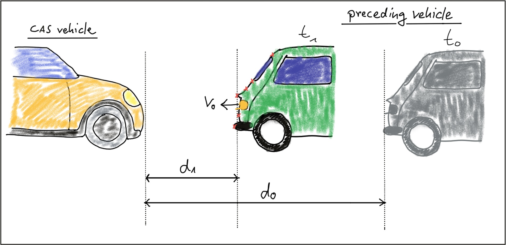
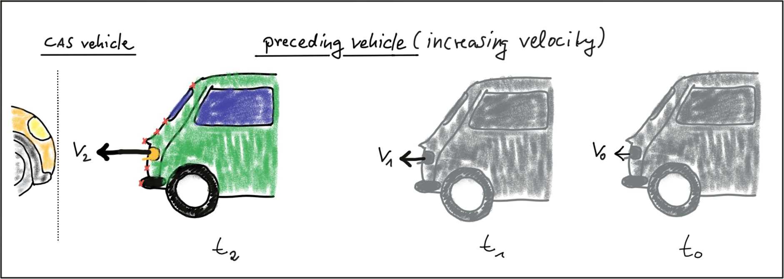
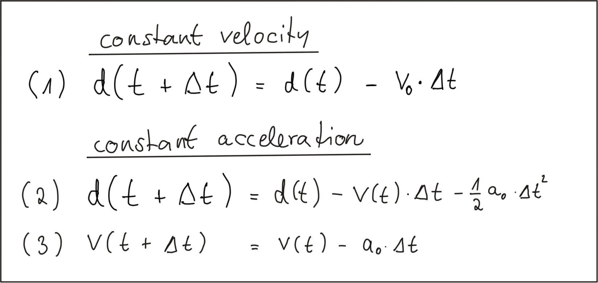

# Collision Detection Problem

A collision avoidance system (CAS) is an active safety feature that warns drivers or even triggers the brake in the event of an imminent collision with an object in the path of driving. If a preceding vehicle is present, the CAS continuously estimates the time to collision (TTC). When the TTC falls below a lower threshold, the CAS can t hen decide to either warn the driver of the imminent danger or depending on the system apply the vehicle brakes autonomously. For the engineering task you will be completing in this course this means that you will need to find a way to compute the TTC to the vehicle in front.

In this traffic scenario, the green vehicle starts to reduce its speed at time t0, which is when the yellow vehicle, equipped with a collision sensor, takes the distance measurement d0. A moment later, at time t1, the green vehicle is considerably closer and a second measurement d1 is taken. The goal now is to compute the remaining TTC so the system can warn the driver of the yellow vehicle or even trigger the brakes autonomously.

Before we can do this however, we need to find a way to describe the relative motion of the vehicles with a mathematical model.

Constant velocity vs. constant acceleration
To compute the TTC, we need to make assumptions on the physical behavior of the preceding vehicle. One assumption could be that the relative velocity between the yellow and green vehicle in the above figure were constant. This would lead to the so-called constant velocity model (CVM) which is represented by eq. 1 in the following diagram.

Once the relative velocity v0 is known, the time to collision can easily be computed by dividing the remaining distance between both vehicles by v0. So given a Lidar sensor which is able to take precise distance measurements, a system for TTC estimation can be developed based based on a CVM and on the set of equations shown above. Note however that a radar sensor would be the superior solution for TTC computation as it can directly measure the relative speed, whereas with the Lidar sensor we need to compute v0 from two (noisy) distance measurements.
