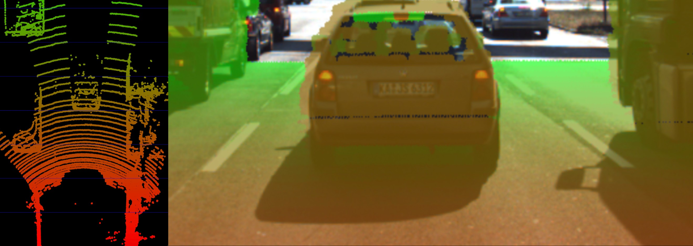
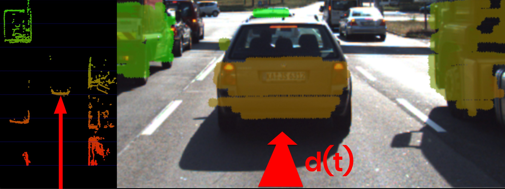
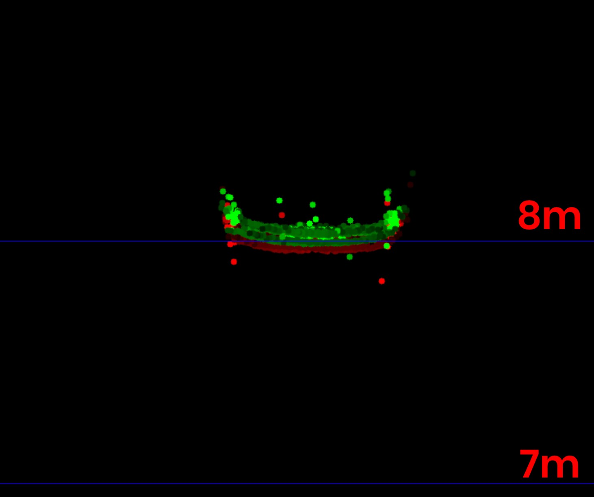

# Collision Detection Problem

A collision avoidance system (CAS) is an active safety feature that warns drivers or even triggers the brake in the event of an imminent collision with an object in the path of driving. If a preceding vehicle is present, the CAS continuously estimates the time to collision (TTC). When the TTC falls below a lower threshold, the CAS can t hen decide to either warn the driver of the imminent danger or depending on the system apply the vehicle brakes autonomously. For the engineering task you will be completing in this course this means that you will need to find a way to compute the TTC to the vehicle in front.

In this traffic scenario, the green vehicle starts to reduce its speed at time t0, which is when the yellow vehicle, equipped with a collision sensor, takes the distance measurement d0. A moment later, at time t1, the green vehicle is considerably closer and a second measurement d1 is taken. The goal now is to compute the remaining TTC so the system can warn the driver of the yellow vehicle or even trigger the brakes autonomously.

Before we can do this however, we need to find a way to describe the relative motion of the vehicles with a mathematical model.

## Constant velocity vs. constant acceleration
To compute the TTC, we need to make assumptions on the physical behavior of the preceding vehicle. One assumption could be that the relative velocity between the yellow and green vehicle in the above figure were constant. This would lead to the so-called constant velocity model (CVM) which is represented by eq. 1 in the following diagram.

Once the relative velocity v0 is known, the time to collision can easily be computed by dividing the remaining distance between both vehicles by v0. So given a Lidar sensor which is able to take precise distance measurements, a system for TTC estimation can be developed based based on a CVM and on the set of equations shown above. Note however that a radar sensor would be the superior solution for TTC computation as it can directly measure the relative speed, whereas with the Lidar sensor we need to compute v0 from two (noisy) distance measurements.

# TTC estimate using LIDAR
### Preparing the Lidar Point Cloud
The following image shows a Lidar point cloud as an overlay over a camera image taken in a highway scenario with a preceding vehicle directly in the path of driving. Distance to the sensor is color-coded (green is far away, red is close). On the left side, a bird-view perspective of the Lidar points is shown as well.

As can easily be seen, the Lidar sensor provides measurements on the vehicles as well as on the road surface. Also, some 3D points in the camera image do not seem accurate when compared to their surrounding neighbors. Especially the points near the roof of the preceding vehicle differ in color from the points on the tailgate.

As measurement accuracy is correlated to the amount of light reflected from an object, it makes sense to consider the reflectiveness r of each Lidar point which we can access in addition to the x, y and z coordinates. An analysis of the associated reflectivity of the point cloud shows that such deviations often occur in regions with reduced reflectiveness.
In order to derive a stable TTC measurement from the given point cloud, two main steps have to be performed:
1. Remove measurements on the road surface
2. Remove measurements with low reflectivity

In the figure below, Lidar points are shown in a top-view perspective and as an image overlay after applying the filtering. After removing Lidar points in this manner, it is now much easier to derive the distance d(t) to the preceding vehicle.

In order to compute the TTC, we need to find the distance to the closest Lidar point in the path of driving. In the figure below, Lidar measurements located on the tailgate of the preceding vehicle are measured at times t0(green) and t1(red). It can be seen, that the distance to the vehicle has decreased slightly between both time instants.

Even though Lidar is a reliable sensor, erroneous measurements may still occur. As seen in the figure above, a small number of points is located behind the tailgate, seemingly without connection to the vehicle. When searching for the closest points, such measurements will pose a problem as the estimated distance will be too small. There are ways to avoid such errors by post-processing the point cloud, but there will be no guarantee that such problems will never occur in practice. It is thus a good idea to perform a more robust computation of minXCurr and minXPrev which is able to cope with a certain number of outliers
